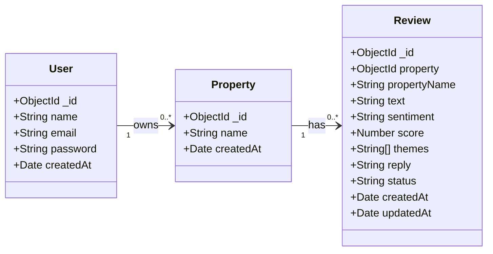

# Homestay Review Insight AI

An AI-powered web application that analyzes guest reviews, detects sentiment and themes, and generates professional management responses for homestay hosts.

---

## 🚀 Tech Stack

### Frontend
- **React.js** (built with **Vite**)
- **Tailwind CSS v4** (CSS-first UI configuration)
- **React Router v7** (browser routing layout wrapper)
- **Lucide React** (modern iconography)

### Backend & Database
- **Express.js** / **Node.js** (REST API Server)
- **CORS** (cross-origin resource sharing)
- **Dotenv** (environment variables configuration)
- **Nodemon** (hot reloading in development)
- **MongoDB & Mongoose ODM** (Integrated in Week 5 for full CRUD operations and data persistence)
- **Bcrypt.js** (Secure 12-round password hashing)
- **JSONWebToken (JWT)** (Secure token authorization headers)
- **Passport.js** (Google strategy integration with simulated fallback support)
- **Zod** (Robust runtime API input validation schemas)
- **Express Rate Limit** (Anti-brute force throttling middleware)

---

## 💾 Database Integration & Schema (Week 5)

### Database Choice and Rationale
We chose **MongoDB** (with **Mongoose ODM**) as the application database. Review data is naturally document-oriented, representing multi-themed analysis reports containing nested properties (like arrays of strings for `themes`, dynamic confidence scores, and text fields). A document-based model provides the structural flexibility required to expand reviews and response templates without rigid relational joint table migrations.

### Entity Relationship Diagram (ERD)
The database schema consists of three primary collections:
1. **User**: Represents hosts or management users.
2. **Property**: Represents homestay listings/properties.
3. **Review**: Represents individual guest reviews connected to a specific Property listing via a 1-to-many relationship (`property` ObjectId reference).



### 💾 Database & Security Configuration

### Set Up the Database and Authentication Secrets
To connect the application to MongoDB and enable security features:
1. Ensure a local MongoDB instance is running at `mongodb://localhost:27017` or obtain a connection string from [MongoDB Atlas](https://www.mongodb.com/cloud/atlas).
2. Create or edit the `backend/.env` file.
3. Configure the following environment variables:
   ```env
   PORT=5000
   NODE_ENV=development
   MONGO_URI=mongodb://localhost:27017/insightstay
   JWT_SECRET=your_jwt_secret_signature_key
   
   # Optional: Standard Google OAuth Client IDs (falls back to a simulated Consent page if empty)
   GOOGLE_CLIENT_ID=dummy-client-id
   GOOGLE_CLIENT_SECRET=dummy-client-secret
   ```
4. Start the backend server (`npm run start` or `npm run dev`). Mongoose will connect to the database and seed default review reports if empty. The auth middleware will automatically enforce token validation.

---

## 📁 Project Structure

```text
homestay-review-insight-ai/
├── backend/                  # Express.js backend application
│   ├── config/
│   │   └── passport.js       # Passport Google Strategy and serializer configurations
│   ├── middleware/
│   │   ├── auth.js           # JWT Authorization validation middleware (requireAuth)
│   │   └── errorHandler.js   # Global error handling middleware
│   ├── routes/
│   │   ├── auth.js           # Register, Login, Me session, and Google OAuth endpoints
│   │   └── reviews.js        # REST API endpoints for reviews (Secured by JWT requireAuth)
│   ├── .env                  # Environment configurations (local only)
│   ├── .env.example          # Template for environment variables
│   ├── package.json          # Node dependencies and scripts
│   ├── server.js             # Main server entry file (Port 5000)
│   ├── verify.js             # Programmatic CRUD verification script
│   ├── verify_auth.js        # Programmatic JWT validation and Rate Limiter test script
│   ├── capture_auth.js       # Puppeteer browser automation screenshot capture script
│   └── compile_pdf_w6.py     # Python PDF deliverable generation script
├── frontend/                 # React frontend application
│   ├── public/               # Static assets & icons
│   ├── src/
│   │   ├── assets/           # React component assets
│   │   ├── components/       # Reusable UI components
│   │   │   ├── ui/           # Documented component library (Button, Toast, Input, etc)
│   │   │   ├── Navbar.jsx    # Dynamic sticky navigation menu (Auth state adaptive)
│   │   │   ├── Hero.jsx      # Welcome banner with glowing layout
│   │   │   ├── Card.jsx      # Reusable content card
│   │   │   ├── ProtectedRoute.jsx # Route Guard checking user authentication before view
│   │   │   └── Footer.jsx    # Categorized link lists & social links
│   │   ├── context/
│   │   │   ├── ThemeContext.jsx # Light/dark mode context toggler
│   │   │   └── AuthContext.jsx # Global JWT session state, sign-in, and authFetch handlers
│   │   ├── pages/            # Application route screens
│   │   │   ├── Home.jsx      # Home landing screen
│   │   │   ├── Dashboard.jsx # Secured analytical dashboard workspace (via authFetch)
│   │   │   ├── About.jsx     # Vision, values, and NLP workflow
│   │   │   ├── Login.jsx     # Dual-view Login & Register templates (with micro-animations)
│   │   │   ├── Profile.jsx   # Secured account dashboard page displaying provider metadata
│   │   │   └── OAuthSuccess.jsx # OAuth receiver extracting callback query params
│   │   ├── App.css           # Local style exceptions
│   │   ├── App.jsx           # Main routing entry and AuthProvider wrapper
│   │   ├── index.css         # Global styles and Tailwind configuration
│   │   └── main.jsx          # React DOM render script
│   ├── package.json          # Dependencies & script configurations
│   └── vite.config.js        # Vite configurations
└── README.md                 # Project documentation
```

---

## 💻 Getting Started (Backend)

To run the backend REST API server on your local machine:

### 1. Navigate to the backend directory:
```bash
cd homestay-review-insight-ai/backend
```

### 2. Install dependencies:
```bash
npm install
```

### 3. Run the development server:
```bash
npm run dev
```
The server will start listening on `http://localhost:5000`.

### 4. Run programmatic CRUD verification:
```bash
node verify.js
```
This runs assertions across the basic database persistent operations.

### 5. Run programmatic Authentication & Rate-Limit verification:
```bash
node verify_auth.js
```
This verifies JWT issuance, access blocking on secure endpoints, validation rules, and brute-force 429 rate limit triggers.

### 6. Run automated screenshots capture:
```bash
node capture_auth.js
```
Uses Puppeteer to run flows in a headless browser, saving captured results to the `/screenshots` folder. Compile them into a PDF by running `python compile_pdf_w6.py`.

---

## 💻 Getting Started (Frontend)

To run the frontend skeleton on your local machine:

### 1. Navigate to the frontend directory:
```bash
cd homestay-review-insight-ai/frontend
```

### 2. Install dependencies:
```bash
npm install
```

### 3. Run the development server:
```bash
npm run dev
```
Open your browser to the local URL (usually `http://localhost:5173`) to view the application.

---

## ✨ Features Implemented (Week 6 — Authentication & Security System)

1. **Secure Registration with bcrypt**: Added `POST /api/auth/register` validating fields using Zod, checking for email duplicates (returns `400`), and hashing credentials via 12-round salt hashing before storing in MongoDB.
2. **JWT Credentials Login**: Set up `POST /api/auth/login` validating inputs, checking hashes, and returning signed JSON Web Tokens expiring in 7 days.
3. **Protected API Endpoints**: Created `requireAuth` middleware evaluating header Bearer tokens, attaching parsed `req.user` details, and securing the reviews API resource.
4. **Passport.js OAuth (Google Provider)**: Configured GoogleStrategy with a seamless simulated consent screen fallback if credentials are unprovided. Handles callback tokens and user creation.
5. **Brute Force Rate Limiter**: Configured `express-rate-limit` restricting IPs to a max of 5 auth attempts per 15 minutes.
6. **Frontend Route Guards**: Added `ProtectedRoute` preventing access to `/dashboard` and `/profile` routes without a valid JWT, redirecting unauthenticated flows to `/login`.
7. **Interactive Profile Page**: Created `/profile` dashboard displaying logged-in user credentials and active provider session metadata.
8. **Automated Deliverables Scripts**: Created programmatic test suite `verify_auth.js`, automated browser flow grabber `capture_auth.js`, and Python PDF layout compiler `compile_pdf_w6.py`. Exported Thunder/Postman test collection (`W6_AuthAPICollection_TBI-26100216.json`).

---

## ✨ Features Implemented (Week 4 — REST API & Full-Stack Integration)

1. **Express.js API Server**: Set up Express.js server running on port `5000` with CORS support, standard error handling middleware, logging, and environment variables.
2. **7 REST API Endpoints**:
   - `GET /api/reviews` - Fetch reviews history with search query (`q`) and sentiment filter.
   - `GET /api/reviews/stats` - Fetch computed metrics (Total, Average Rating out of 5.0, Sentiment Index, Responses Generated).
   - `GET /api/reviews/:id` - Fetch details of a single review.
   - `POST /api/reviews` - Create a review analysis report (triggers rule-based NLP AI simulation).
   - `PUT /api/reviews/:id` - Update response draft content or status.
   - `DELETE /api/reviews/:id` - Remove a review report from history.
   - `POST /api/reviews/sync` - Simulates bulk-importing external reviews from Airbnb and VRBO.
3. **Automated Verification Script**: Created `verify.js` using native `fetch` assertions to programmatically validate all endpoints, return status codes, and check JSON response integrity.
4. **Full-Stack Connection**: Connected the React frontend using `fetch` to replace all hardcoded mock data.
5. **Interactive CRUD Panel**: Implemented a "Recent Analyses History" panel in the Dashboard allowing users to search, filter by sentiment, load in editor, edit drafts inline via PUT, and delete reports via DELETE.
6. **Testing Deliverables**: Exported Postman/Thunder Client testing collection (`W4_APICollection_TBI-26100216.json`) and compiled screenshots connection PDF (`W4_FrontendBackendConnection_TBI-26100216.pdf`).

---

## ✨ Features Implemented (Week 3 — UI/UX & Component Design)

1. **Documented Component Library**: Constructed modular UI elements (`Button`, `Input`, `Modal`, `Toast`, `Loader`) under `frontend/src/components/ui/` with props documented using JSDoc styles.
2. **Theme Toggle & Persistence**: Implemented a responsive theme toggler (backed by `localStorage` persistence) allowing real-time light and dark mode switching.
3. **Layout Wireframes**:
   - Shareable Figma Board: [Figma Wireframes Board](https://www.figma.com/board/18SZKYEPnDp1EjTV2552br/W3_Wireframes_TBI-26100216?node-id=0-1&t=DmjPhSZWPQxlGo23-1)
   - Compiled PDF: `W3_Wireframes_TBI-26100216.pdf`
4. **Responsive Breaking Checks**: Compiled responsive screenshots PDF: `W3_ResponsiveScreenshots_TBI-26100216.pdf`

---

## ✨ Features Implemented (Week 2 — Frontend Foundations)

1. **Vite + React Setup**: Configured with strict production compilation capability.
2. **Tailwind CSS v4 & Fonts**: Configured Outfit and Plus Jakarta Sans Google Fonts, smooth backdrop-blur glassmorphic styles, and customized scrollbar layouts.
3. **Responsive Navbar**: Includes links mapping to all pages, showing active route states, and a hamburger drawer layout on mobile viewports.
4. **Interactive Dashboard**:
   - Simulated sentiment meter showing positive, mixed, and negative results.
   - Sample buttons that load real-world review scenarios.
   - Textarea input and simulated loading state.
   - AI Response copy-to-clipboard functionality.
5. **Modern Card Grid**: Responsive grid displaying product values with smooth transform hover state effects.
6. **Detailed Pages**: Interactive login templates, workflow process steps on the about page, and clean layout baselines on the home page.
